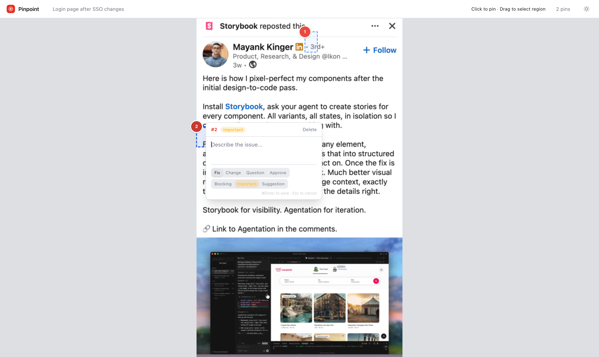

<div align="center">


<h1>Pinpoint</h1>

<p>Visual annotation MCP for AI coding agents</p>
</div>

---

<p align="center">
  
</p>

Point at what's wrong. Claude fixes it.

Pinpoint opens a browser UI where you click to pin and drag to box regions on any screenshot. Your annotations flow back to Claude as structured feedback — coordinates, comments, severity — so it can fix exactly what you pointed at.

Works with any visual surface: web pages, iOS simulators, macOS apps, Storybook, design mockups. No target app modification needed.

## Install

```bash
curl -fsSL https://raw.githubusercontent.com/maferland/pinpoint-mcp/main/install.sh | bash
```

<details>
<summary>Manual install</summary>

```bash
git clone https://github.com/maferland/pinpoint-mcp.git ~/.pinpoint-mcp
cd ~/.pinpoint-mcp && bun install
claude mcp add pinpoint -- bun ~/.pinpoint-mcp/src/main.ts --stdio
```
</details>

Restart Claude Code. Then ask Claude:

> "Take a screenshot of localhost:3000 and open it for annotation"

## How It Works

**You** annotate in the browser:
- **Click** anywhere → places a pin with a small highlight box
- **Drag** → draws a rectangular region
- Click a pin → popover to type your comment, set intent and severity
- **⌘Enter** saves, **Esc** cancels
- Multiple screenshots → filmstrip with arrow keys to switch

**Claude** reads structured feedback:
```
#1 [fix/blocking] box(10.2%, 5.3%, 35.0%x12.5%): Button text is truncated on mobile
#2 [change/suggestion] box(60.0%, 80.1%, 30.0%x15.0%): Footer spacing too tight
```

## MCP Tools

| Tool | Description |
|------|-------------|
| `create_review` | Open one or more screenshots for annotation. Auto-opens browser. |
| `add_image` | Add another screenshot to an existing review. |
| `get_annotations` | Read structured feedback — coordinates, comments, severity. |
| `list_reviews` | List all review sessions. |
| `resolve_annotation` | Mark an annotation as resolved or dismissed. |

## Requirements

- [Bun](https://bun.sh) 1.2+
- [Claude Code](https://claude.ai/code)

## License

[MIT](LICENSE)
