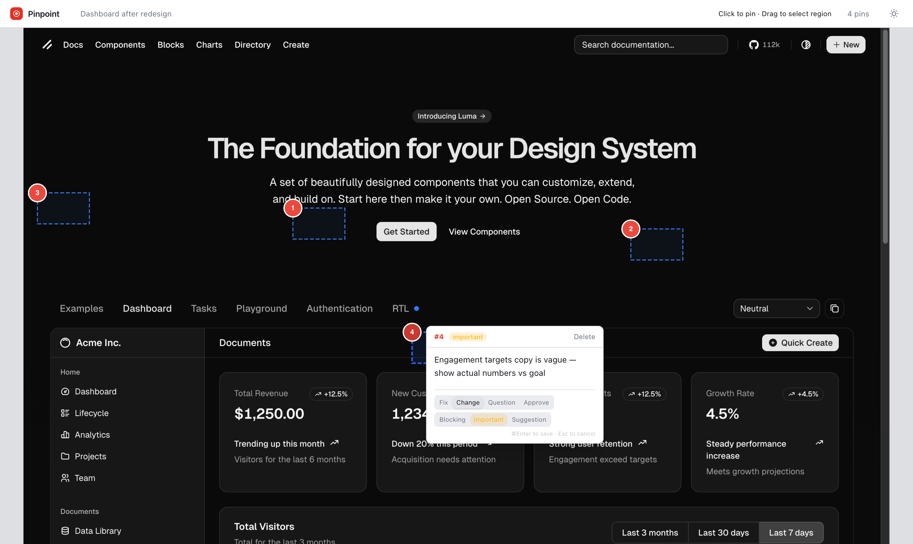

<div align="center">


<h1>Pinpoint</h1>

<p>Visual feedback for AI agents</p>

</div>

---

<p align="center">
  
</p>

The best way to provide visual feedback is to your AI agent. Pinpoint allows
you to share contextual feedback with your agent by dropping pins and comments
on screenshots, mockups, or any visual content.

Works on anything visual: web pages, simulators, native apps, Storybook,
mockups.

Reviews export to a `.pinpoint.zip` too. Hand it to a designer or PM, they drop
pins, you re-import.

## Try it live

Nothing to install.
**[pinpoint.maferland.com/try](https://pinpoint.maferland.com/try.html)**: drop
a pin, type a comment, hit Send.

## Install

### Claude Code

```
/plugin marketplace add maferland/pinpoint
/plugin install pinpoint@pinpoint-marketplace
/pinpoint:install
```

The first two add the marketplace and install the plugin (slash commands +
skill). The third builds the CLI binary and links it onto PATH. Restart Claude
Code once it finishes.

### CLI only

```bash
curl -fsSL https://raw.githubusercontent.com/maferland/pinpoint/main/install.sh | bash
```

<details>
<summary>Manual install</summary>

```bash
git clone https://github.com/maferland/pinpoint.git ~/.pinpoint
cd ~/.pinpoint && bun install && bun run build
bun link                                                  # exposes `pinpoint` on PATH
claude plugin marketplace add ~/.pinpoint                 # registers the slash command (Claude Code only)
claude plugin install pinpoint@pinpoint-marketplace
```

</details>

Requires [Bun](https://bun.sh) 1.2+.

Once installed, `pinpoint demo` opens a local sandbox session with starter pins
on a real screenshot. No target image needed to try the real CLI loop.

Update in place any time with `pinpoint update` — it pulls the latest, rebuilds,
and relinks.

## Use it with your agent

### Claude Code: slash command

```
/pinpoint:review /tmp/screenshot.png
```

The browser opens, you annotate, hit **Send** in the toolbar, the structured
JSON lands in the conversation.

### Anywhere with a shell: direct CLI

```
pinpoint review <image>... [--context "..."] [--port N]
```

Spawns the annotation server, opens the browser, blocks until you hit **Send**
in the toolbar, prints the structured JSON to stdout. Pipe it wherever you want.

## How the annotation UI works

- **Click** anywhere → drops a pin with a highlight box
- **Drag** → draws a rectangular region
- **Click a pin** → popover with a textarea, type your note
- **⌘Enter** saves, **Esc** cancels
- Multiple screenshots → filmstrip with arrow keys to switch
- The send button in the toolbar describes itself: **Looks good** if you've made
  no annotations, **Send 3 comments** (or whatever the count is) if you have.
  Either way it closes the loop and returns control to the agent.

What Pinpoint sends back:

```json
{
  "annotations": [
    {
      "number": 1,
      "image": "/tmp/screenshot.png",
      "box": {"x": 10.2, "y": 5.3, "width": 35.0, "height": 12.5},
      "comment": "Button text is truncated on mobile"
    }
  ]
}
```

Coordinates are percentages, so they're resolution-independent.

## Sharing a session

A review packages into a `.pinpoint.zip` (review manifest plus the raw image
bytes). Open it on any machine that has Pinpoint installed.

```bash
pinpoint export <reviewId>                            # writes <reviewId>.pinpoint.zip
pinpoint open path/to/bundle.pinpoint.zip             # someone hands you a session
pinpoint open path/to/bundle.pinpoint.zip --mode new  # keep your local copy untouched
```

The ⬇ button in the toolbar exports the live session straight to your downloads
folder. See [the skill docs](skills/using-pinpoint/SKILL.md) for the full flow.

### Sharing across networks

`pinpoint share` hands a review to someone on a different network without
either of you standing up infrastructure:

```bash
pinpoint share <reviewId>              # prints a link
pinpoint open <link>                   # on the other machine
```

The review is encrypted in your terminal before anything leaves it. Small
reviews (text feedback, no screenshots worth mentioning) are embedded straight
in the link — nothing is uploaded anywhere. Larger reviews go through a relay
that only ever stores ciphertext; the decryption key lives in the link's `#`
fragment, which never travels over HTTP, so whoever operates the relay can't
read the content even if they wanted to. Treat the link like a password — send
it over a channel you trust, not a public one. Links expire after 14 days by
default (`--ttl DAYS` to change it), and `--server URL` points at a
self-hosted relay instead of the default one.

## Credits

Architecture inspired by
[plannotator](https://github.com/backnotprop/plannotator): slash command shells
out to a CLI binary, blocks until the user finishes their part, pipes structured
stdout back into the conversation. Pinpoint applies that pattern to image
annotation, and adds a portable session format on top.

See [CHANGELOG.md](CHANGELOG.md) for release history.

## License

[MIT](LICENSE)
